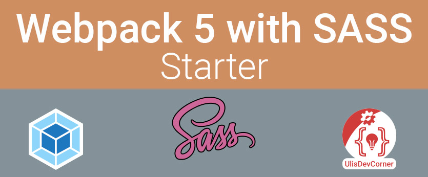

## Last Updated  
2022-11-06

I try to keep it up to date. I've a video if you want to know how to update by yourself if I'm not fast enough 😊  

[**YouTube**: Updating NPM Packages to the latest Version](https://youtu.be/GAvu7Jg2B9o)

## Versions  
**NodeJS**: 16.15.0

**Webpack**: 5.74.0  
**HTML Webpack Plugin**: 5.5.0  
**Babel Core**: 7.20.2  
**SASS**: 1.56.0  

## Intro
This repo is just a starter for my videos on my YouTube Channel.   

[**YouTube**: UlisDevCorner](https://www.youtube.com/@ulisdevcorner)

## GitHub Repo of UlisDevCorner
To find the repo of the videos I show on my YouTbe channel please visit this link.

[**GitHub**: UlisDevCorner](https://github.com/UlisDevCorner)

## Install from Scratch
If you wish to install all the packages from scratch, remove the field "devDependencies {...}" from the package.json file, and run the following command, by copy and paste it in your terminal.

```npm i -D @babel/core @babel/preset-env autoprefixer babel-loade browser-sync clean-webpack-plugin copy-webpack-plugin css-loader css-minimizer-webpack-plugin html-webpack-plugin mini-css-extract-plugin postcss-loader sass sass-loader style-loader terser-webpack-plugin webpack webpack-cli webpack-dev-server```

